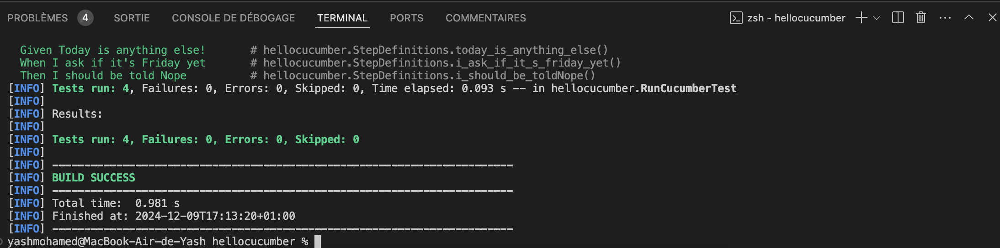

= R5.A.08 -- Dépôt pour les TPs
:icons: font
:MoSCoW: https://fr.wikipedia.org/wiki/M%C3%A9thode_MoSCoW[MoSCoW]

Ce dépôt concerne les rendus de mailto:anli-yachourti.mohamed-said-youssouf@etu.univ-tlse2.fr[Jonh Doe].

== TP1

.Code gherkin
[source,gherkin]
----
# language: en
Feature: Is it Friday yet?
  Everybody wants to know when it's Friday

  Scenario Outline: Sunday isn't Friday
    Given Today is <day>
    When I ask if it's Friday yet
    Then I should be told <answer>

    Examples:
      | day            | answer |
      | Friday         | TGIF   |
      | Sunday         | Nope   |
      | anything else! | Nope   |
----

.Exemple d'image insérée en asciidoc

== TP3

.Code gherkin
[source,gherkin]
----
# language: en
Feature: Is it original ?
  \No TP must be generated by an AI or steal from some other source

  Scenario: A student should not generate a TP using an AI
    Given A TP from a student
    When I check if the TP is not AI generated
    Then I should be told "Yes"

  Scenario: A student should not steal a TP from some other source
    Given A TP from a student
    When I check if the TP is not stolen
    Then I should be told "Yes"
----

